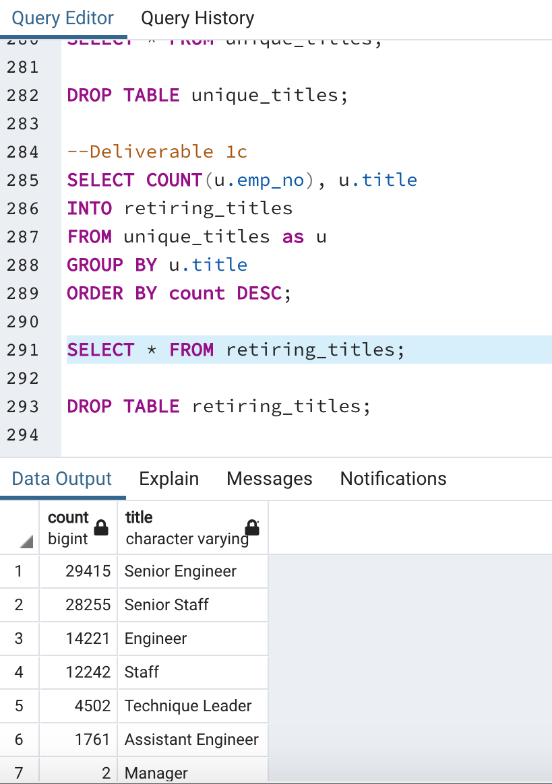
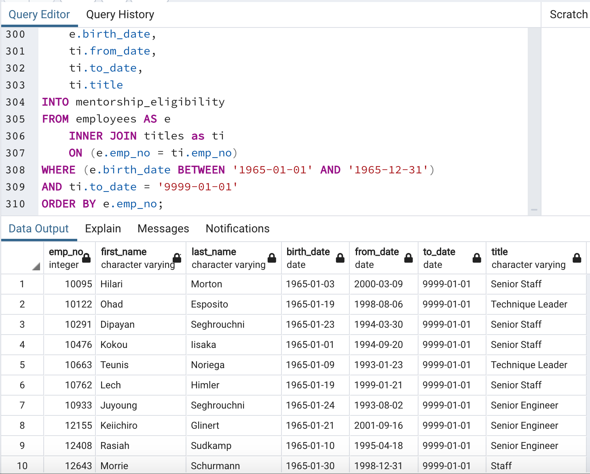

# Pewlett_Hackard_Analysis

## Overview
The Purpose of this analysis was to use pgAdmin 4 to determine the number of retiring employees per title, as well as to identify the employees who are eligible to participate in a mentorship program. My objective is to create a report to help prepare for the "silver tsunami" due to the amount of current employees reaching retirement age. 

## Results
### Takeaways for Deliverable 1
For Deliverable 1, I had to create tables that hold all the titles of the employees born between January 1, 1952 and December 31, 1955. I then had to determine the amount of retirement age employees by their recent job title and make sure I do not add those who already left the company. 

According to the data, there are 90,398 total positions that will be available due to the amount of employees retiring. These positions range from staff members, managers, and senior engineers which can be seen below. One detail I noticed about the data was that there seems to be a vastly disproportionate amount of managers retiring compared to other positions like senior engineers and senior staff. This is most likely because at Pewlett-Hackard, there is one manager that has a lot of staff under them. But it was still odd to see that the managers retiring did not at least break double digits with even the next lowest amount of titles being "Assistant Engineer" with 1,761. 
This brings me to a similar detail where other positions (such as Assistant Engineer) are vastly overshadowed by the need of Engineers. According to my data, there are 1761 retirees for Assistant Engineer and over 14,221 retirees as Engineers. Like with the managers, I wonder why there is such a large amount of engineers retiring with so few assistant engineers. Perhaps the Assistant Engineers who are still working can help fill the need of engineers when they retire.

#### Retiring Titles 

### Takeaways from Deliverable 2
For Deliverable 2, I was tasked to create a mentorship-eligibility table that holds the current employees born between January 1, 1965 and December 31, 1965. In this table, there are 1541 employees that are eligbile for a mentorship program. Immediatley I noticed that due to the table only containing employees born in the year 1965, this table has potential to have much more data of those eligibile to participate in the program. An example, would be to not have a restriction based on the birth year. If Pewlett-Hackard allowed not just expereinced, but younger employees to participate in this program, there can be even more eligibile for the mentorship program.

#### Mentorship-Eligibility 

## Summary

## Resources
